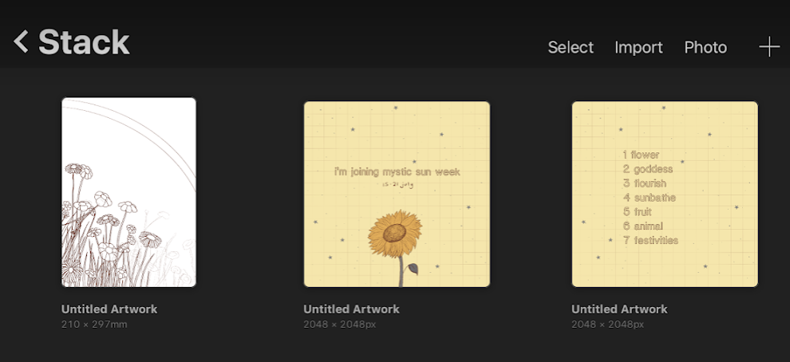

# What’s new with me
Next week I’ll be taking part in [#mysticsunweek](https://www.instagram.com/explore/tags/mysticsunweek/) so I have started doing some sketches for the first few pieces. I’m doing the linework digitally then I’ll trace them and paint them up with watercolour. Getting back into that analog stuff.

I also restarted a commission that my friend asked for back in February. My first attempt was a bit of a flop, because I didn’t have the confidence with painting. By now I think I can do a better job, so version 2 started this week! I’ll share some process photos once it’s properly underway.

Lastly I finally announced on Instagram that I’ll be going to Camberwell College this September. I got in a few months ago, but had to wait until I told work so I didn’t cause any drama. It feels good to get it out in the open. It’s a Graduate Diploma in Illustration which, I have been led to believe... is a course levelled somewhere between a BA and an MA, aimed at those who have a non-art degree and want to move in to the field. My first degree was in Maths so it sounded perfect for me. They haven’t sent me much information on the course yet, and it’s the first year that they are running it, so I am feeling impatient with wanting to find out and share more details!

# What’s inspiring me
This week it’s all about [Holly Exley](https://www.youtube.com/channel/UCQRpKldwdkyBW3qgCVZNrMA)! I have been following her for the best part of a year now but I’ve really gotten into her content recently. I think it’s because I am getting back in to watercolour, and her work is so beautiful. If you haven’t checked her videos out I highly recommend it, especially for business, freelance and watercolour advice.

# Nice things from the internet
The [Illustration Hour podcast](https://www.illustrationhour.com/): super relaxed, and I recommend the first episode for others who joined the illustration game a bit later in life.

[This vlog](https://www.youtube.com/watch?v=bBOxZxXaY6o&t=1170s) by Minnie Small also inspired me to sort my life out a bit. Mid-year crisis averted… 

See you next week xx
