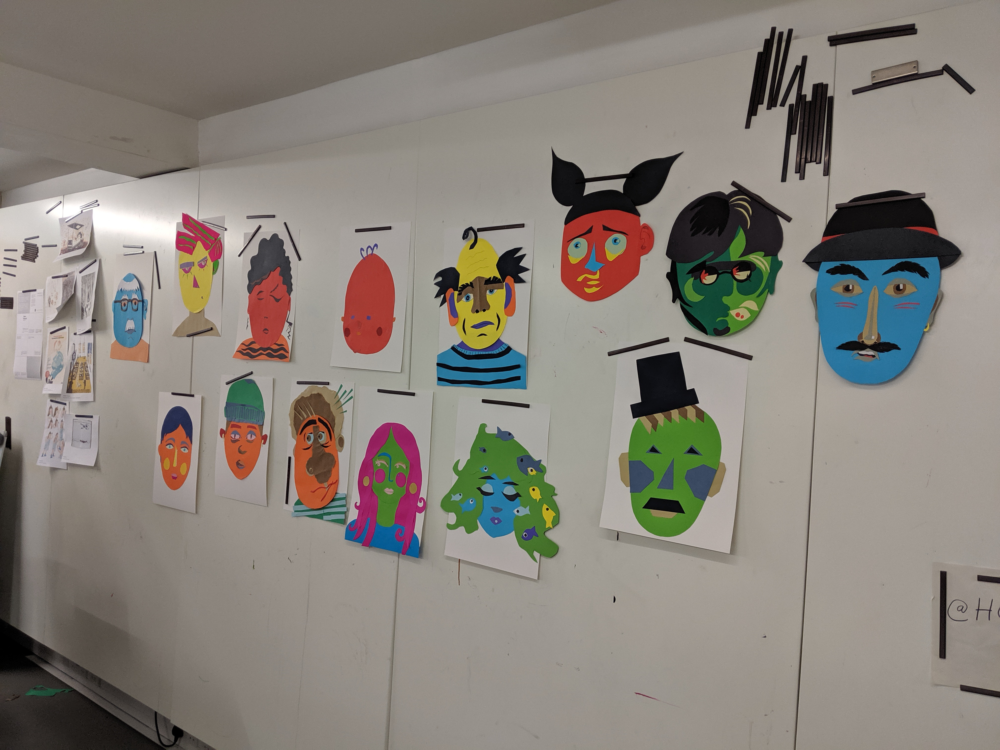
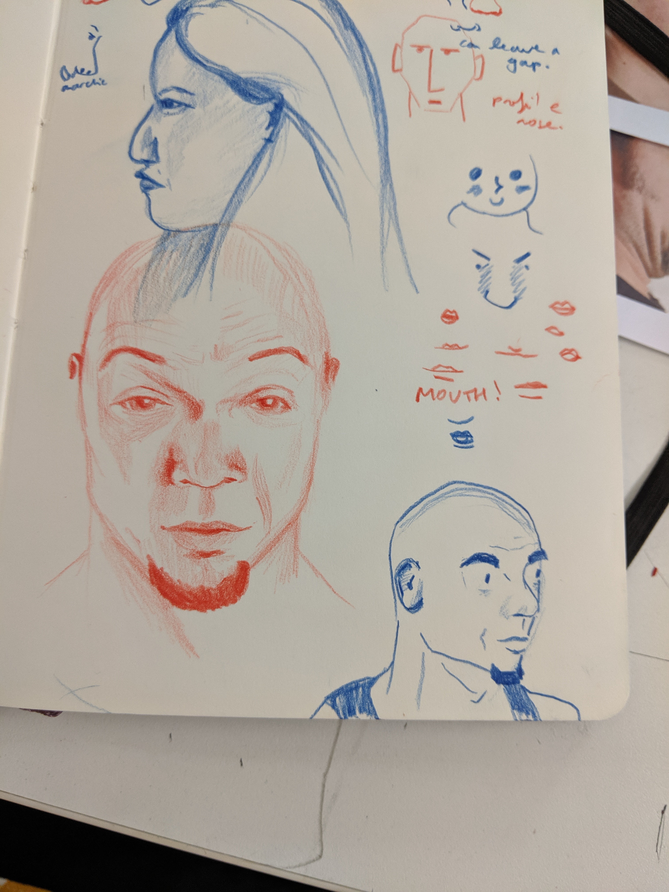
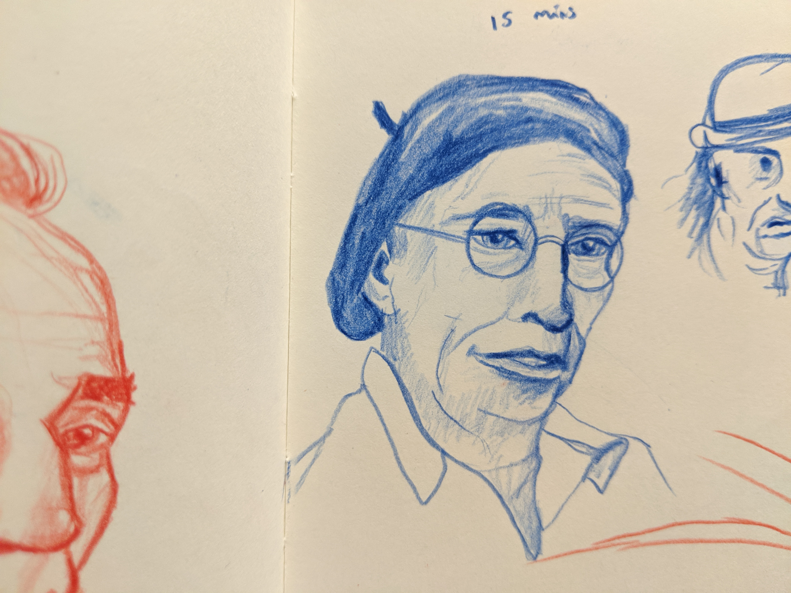
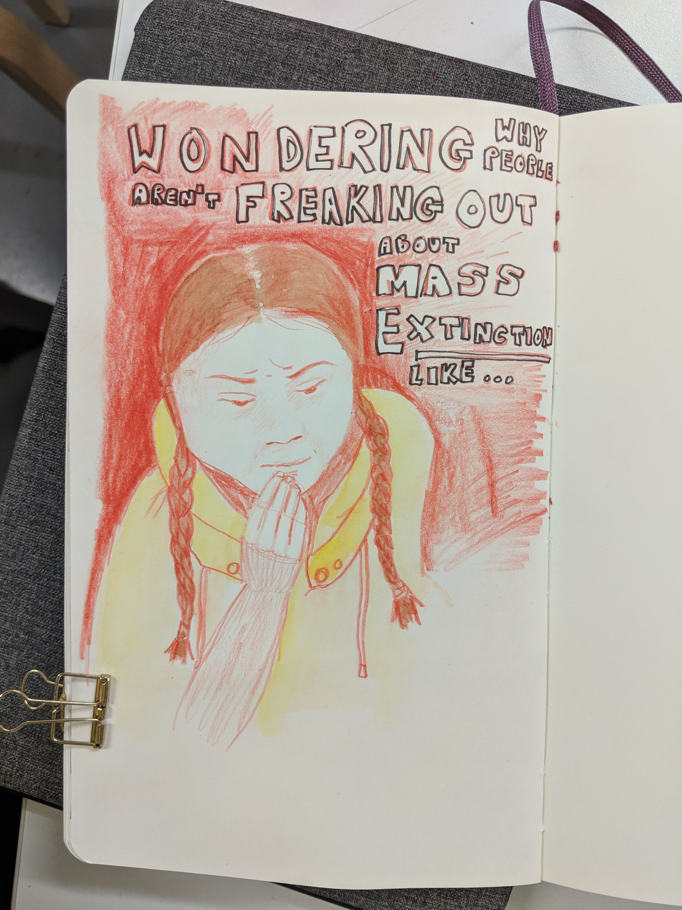

# What's new with me
I've finished my full time job! I felt suuuper anxious about it, because I’ve been in this career (or studying towards it) for a very long time. But now I am really looking forward to not having to go to an office, or do data analysis every day.  It was bittersweet :)

This month has been really busy, looking back. I went to Prague, Blackpool and Norfolk, so lots of mini-breaks! I planned to do travel art journals but I was with groups of either family or friends the whole time and didn’t really find a spare minute to draw. In September I’m off to Nepal with the boyfriend for a much longer trip, and a more unique one, so I’ll definitely document that in my sketchbook. I think travel sketchbooks are a really good idea… both to inspire future work but also for a personal keepsake of the trip.

I also went to a week-long summer school at the House of Illustration, focussed on people illustration. It was intense but really useful. I’m planning a separate blog about what I learned and how I’m developing my style for people, but here are some photos from the week for now:

# What's inspiring me
Recently I read [this interview with mcbess](https://www.itsnicethat.com/features/mcbess-interview-illustration) which pleasantly surprised me. I’d love to make work that’s a detailed and “edgy” but thought this wouldn’t be commercially interesting, i.e. companies wouldn’t commission me for it. However, mcbess has a really dark and detailed style yet has worked with TFL and other companies. It’s inspired me to stop thinking about what will be commercially viable and make stuff for myself a bit more.

Thanks for reading xx
