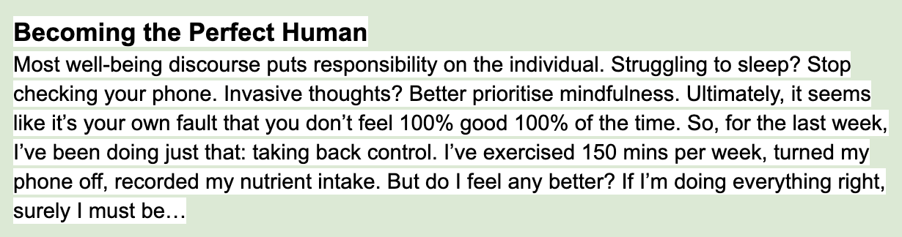

### The brief

The editor of the magazine sent over this paragraph to describe the article. I immediately thought of my experiences with a Fitbit - obsessively tracking everything, even doing steps and star jumps around the room to "earn" a beer at one point. This was about 6 years ago and I've since learned Fitbits are not for me... Anyway, my concept was about tracking, dials and screens.

### Initial sketch and digital version

I went with an idea of a small figure desperately struggling to keep all the metrics, dials and gauges at the correct level; trying to optimise their body. 

### Second version

I dabbled with putting the figure on a precarious stepladder, to make them feel really out of control. But then I decided to integrate the figure to the panel, to drive home the point about the character monitoring themselves. The client preferred this approach, so we ended up with...

### Final illustration

You can check out the illustration in situ on the Mood magazine website - the article got tweaked to discuss self-improvement in isolation/lockdown, but our character still fits! Read it [here.](https://www.itsmoodmag.com/power/becoming-perfect-self-optimise)

If you'd like to work together, please [get in touch](mailto:vicky.hughes@hotmail.com)!