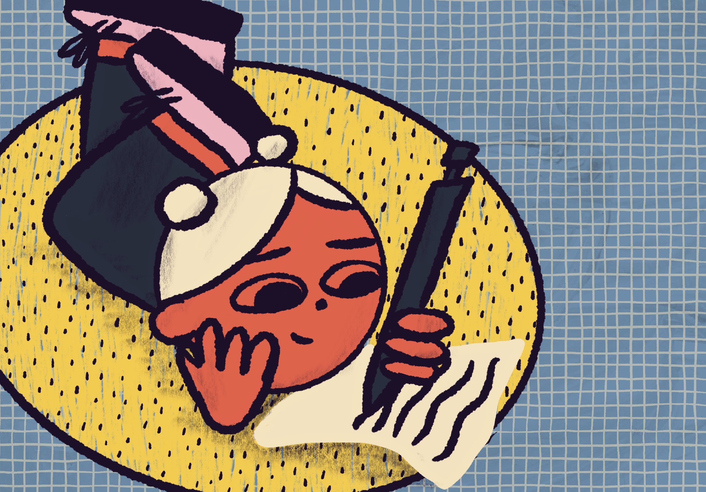

I was recently contacted by a Katrien Van de Put, a student from Belgium, for an interview - in case you'd like to know more about me and my process, here it is!

### What is your name/do you have an alias? 
My name is Vicky Hughes, and on social media I use the handle @vickymadethis .

### What/where did you study?
At the moment, I’m studying for a Graduate Diploma in Illustration, at Camberwell (UAL). But the first time I went to uni I studied Maths, I got an MMath degree from Sussex which was a 4 year combined BSc/MSc course. I finished that in 2014.

### How long have you been working in the creative world?
Not long! I used to work as a data scientist, until August last year (2019). That’s when I quit and went back to uni, although I stayed on as a part-time contractor at my old job. In December, I got my first paid job as an illustrator which was actually commissioned by my old company. They were having a rebrand, and were looking for an illustrator but hadn’t asked me to do it. So, I asked to see the brief and worked over the weekend to pitch them a draft on Monday. They decided to go with it so it worked out really well, I’ve had more commissions from them since.

### What are your experiences (life and work) in London?
I moved here after my first degree in 2014 to join the Civil Service graduate scheme as a statistician (not very fun). I worked my way up that for 4 years and moved house quite a lot. When I first moved here I didn’t really know anyone so I lived with some other women from my grad scheme, but then as my friends started moving here (I’m from a town nearby), I moved in with them. I met my fiancé on Tinder… and most of my friends started coupling off with Tinder peeps too. I moved in with Ed after a few years of dating, I’ve lived with him for nearly 3 years now. We’ve got a little one bed flat near my uni.

I like living in London mostly because most of my friends live here, too. But everyone talks about leaving now and then. There’s loads of stuff to do in terms of galleries and exhibitions, so it’d be interesting if we do leave to see how much we took for granted. It was also really great that I didn’t have to leave my home to study at one of the best universities for illustration. But I get pretty stressed out here sometimes and occasionally don’t feel safe. I’m not sure if that’s a London thing or the same in other major European cities. For now, it’s my home and usually don’t notice the mad hecticness of the city anymore.

### How do you get inspired?
These days I get inspired by meditating every day and seeing what pops into my head. Sometimes it’s random imagery, presumably from a memory, or sometimes I get a clear picture for a piece or a plan for some research to do. I’m doing a lot of work about the topic of thoughts that pass through our brain, so by meditating I also get new ideas for characters for that project.

I have a few books which really inspire me. At the moment my favourites are Illustration Next and Fifty Years of Illustration. I also love the Pictoplasma books and Dover Pictorial Archives. I also like looking at other people’s work. My favourites at the moment are Charlotte Dumortier and Hel Covell. But I try not to look at their work and those books I mentioned too much, else I’ll either start copying or just get depressed that I’m not as established as them. So I also like to read novels, go for walks, watch interesting movies and generally just try and live a full life with experiences that can inspire me. I’d like to say I’m inspired by travel but I normally don’t draw on holiday, although maybe those experiences subconsciously do something.

### How do you overcome a creative block?
Recently I’ve enjoyed going on Unsplash - a stock photo site - or Quickposes, and spending 30-60 minutes sketching photos on a theme. But if I’m really not feeling it I’ll just take a day off. Often that’s all I need; a day of permission to do nothing and read my book, nap, watch telly, talk to friends. Then by the next day a bit of my pep will probably have come back. It’s also about making a habit out of creativity. Sometimes I have a commission so I have to work even if I don’t feel like it. I’ve got a process now which works for me; flipping through books, sketching from photos, writing down words about the brief. Then by the time I’ve done that there will be some clear ideas for an illustration. Other people like to work differently but it’s just about what works for you, even if you’re not in the right mood.

### How do you start a project? When do you know it is finished?
Oops I kinda answered this already. I start a project by researching the brief online, jotting down key words or concepts, flipping through inspirational books, sketching from relevant photos. If possible I might also go to a museum and spend the day drawing there (I love the Museum of Childhood for getting weird character ideas). Once I’ve done all that, there will be some ideas to go forward with. 

As for when it’s finished - I get pretty bored of working on the same project/piece quite quickly, so I reckon sometimes I probably finish earlier than I should… But it’s finished when I can close it, leave it, reopen it the next day and still like it. 

If you’re working on a project and are falling behind, would you ask for an extension to refine your illustration or submit an OK piece of work on time?
I’d probably send the best version I could before the deadline, explain my circumstances, offer them the option of using this version or waiting slightly longer for a new one. I’m pretty obsessed with planning, and Todoist, and I try really hard not to fall behind. But if there’s a good reason, that’s what I’d do, I think.

What type of design work do you enjoy the most: print or digital? Why?
Digital. I just like to tweak and move stuff around. Although I said I’m obsessed with planning - I don’t really like planning layouts and composition. I just like planning tasks. Once I’ve done a few thumbnails I’ll start working larger so it suits me better to be able to move the sketch around. And I am quite impatient so I like not having to mix paint - I used to work in watercolour quite a bit. I would like to learn more printing processes, like screen printing or Riso. I was planning to do so this April but obviously we can’t leave the house at the moment, so.

### How do you prepare your work for production?
Depends on the project. Most of it is for screens at the moment so it’s either sorting out file sizes, resolutions, SVGs, or for example I did a babygrow design which needed Pantone colours sorting out. And I go over the illustration really zoomed in checking it all looks clean. And send it to my family/friends/partner to have a look at, I’ll have been looking at it for so long I might have missed something that looks off.

### What design software do you use?
Depends on the project but my favourite is Procreate, it’s just the easiest. I use Fresco on my iPad to do vector illustration. And I use all the Adobe desktop stuff if I have to.

### How do you learn about new techniques and tools?
Skillshare, Domestika, YouTube. I spend about half a day per week learning new techniques and tools online, including business and freelance stuff. I also just experiment with what I have at home in my “art cart” and see what comes out.

