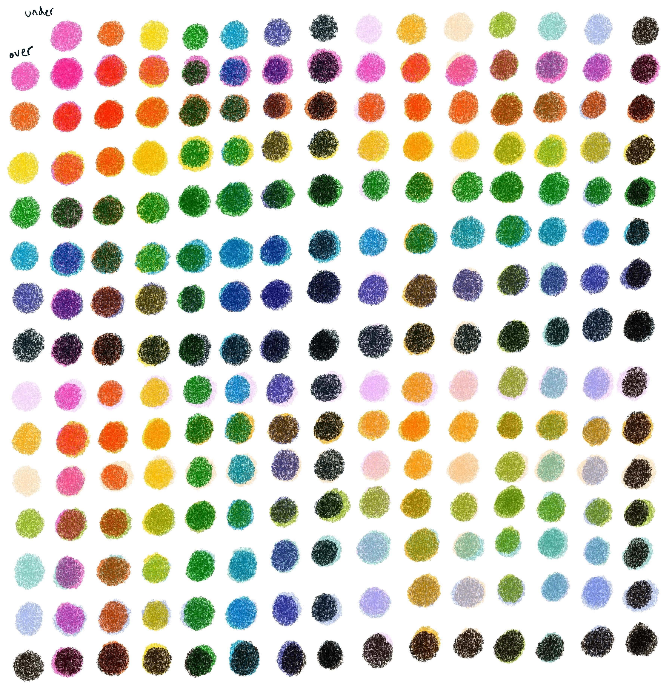
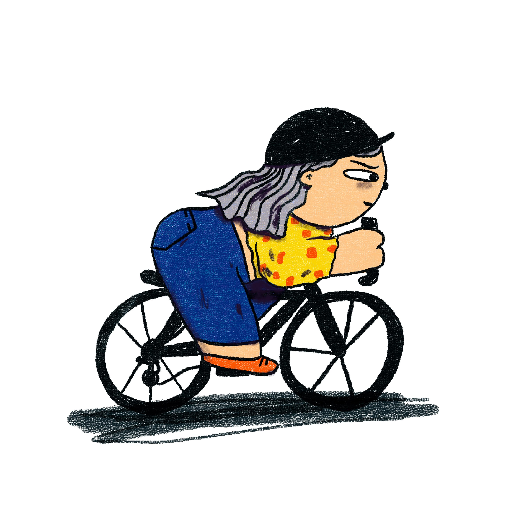
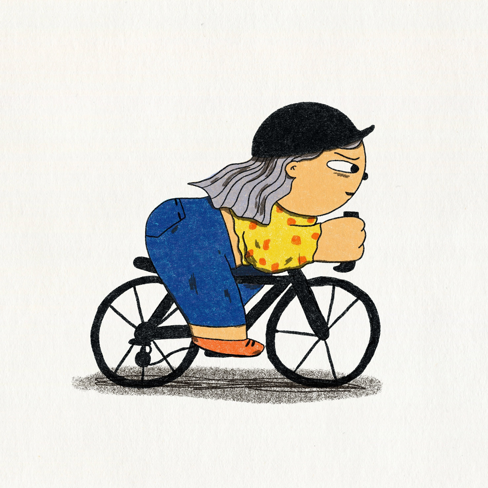
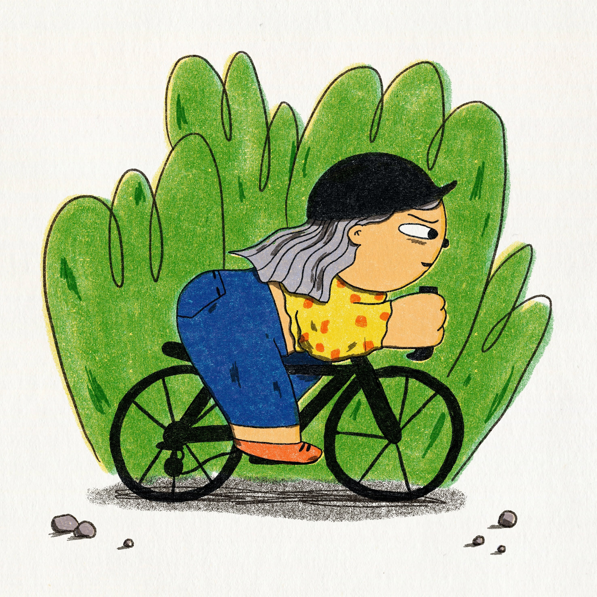
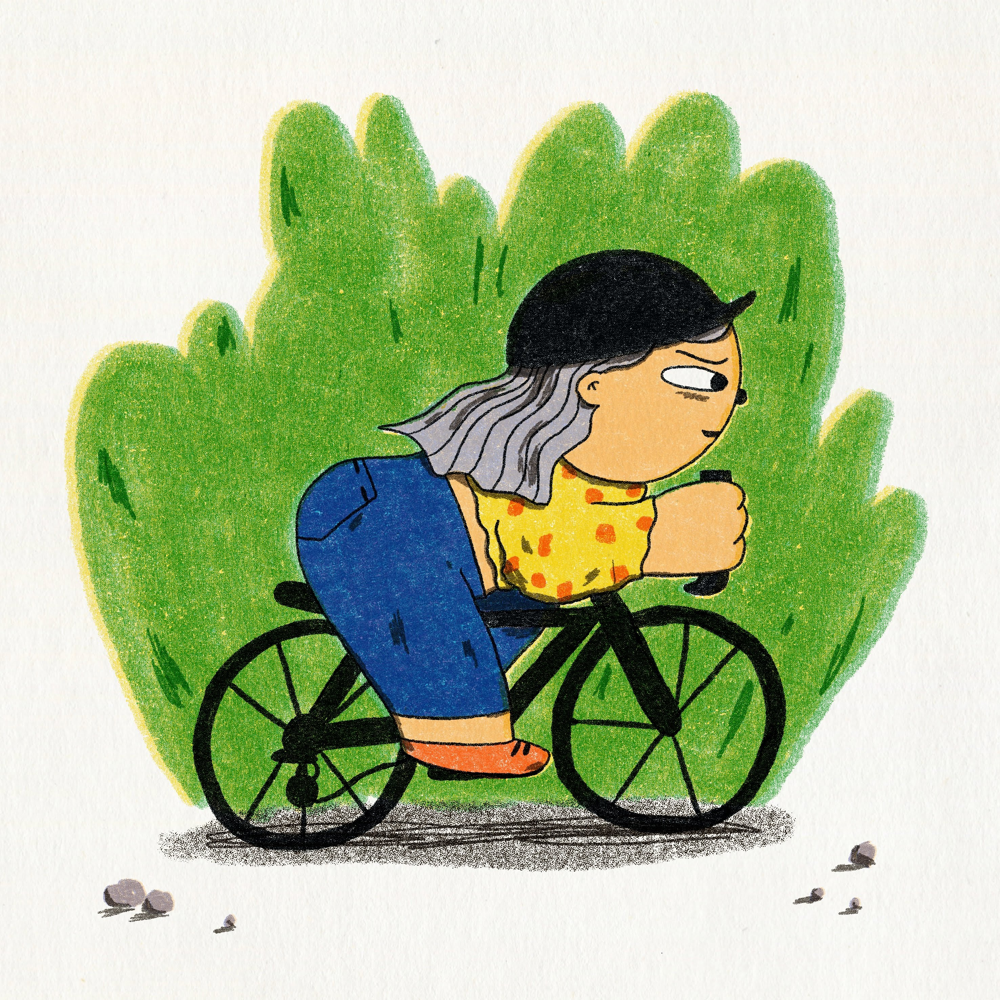

I've been admiring the work of [Nat Andrewson](https://natalie-andrewson.com/filter/Risograph) lately, and really wanting to make my own RISO print. But... we're in lockdown. I had a quick Google and found some RISO Procreate brushes from [Tiptop brushes](https://tiptopbrushes.com/products/riso), and gave 'em a spin. It came with a colour palette so I had a look at how they combined:

Then took a character from one of my previous pieces and experimented with adding the brushes and colours from the pack:

She looked a bit too much like a downhill cyclist, here's the final gal all straightened up.

I just wish I looked this call on my bike. My Halfords road bike was excellent value but absolutely no hipster points.
