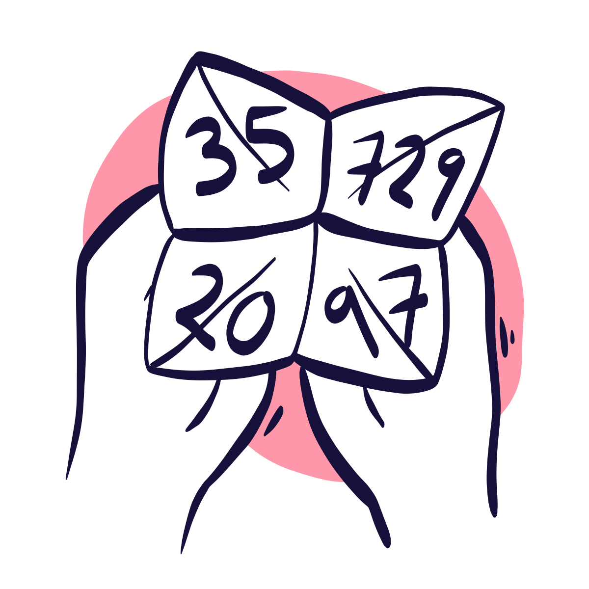
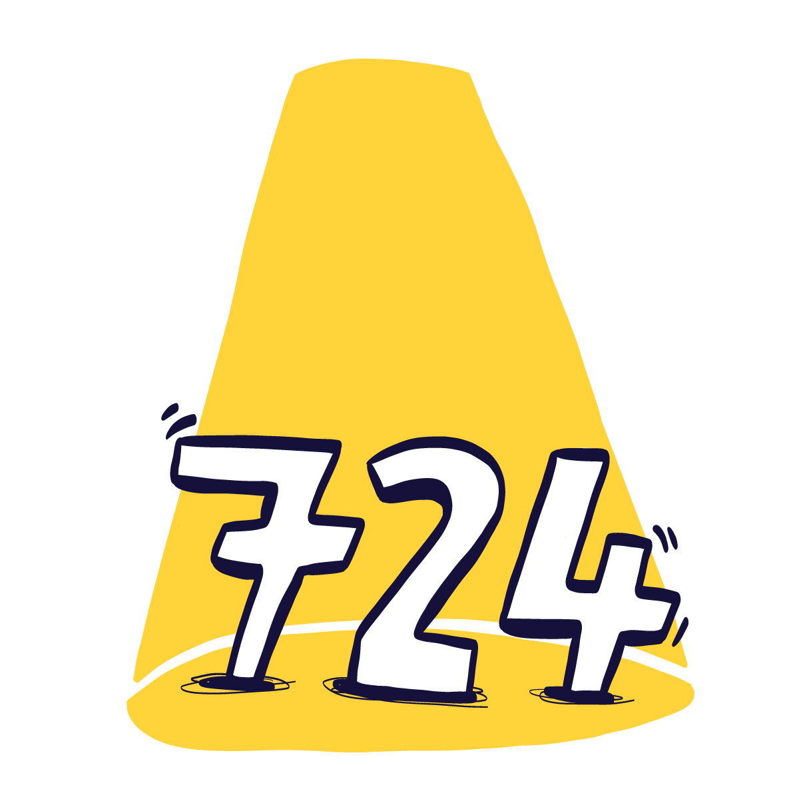
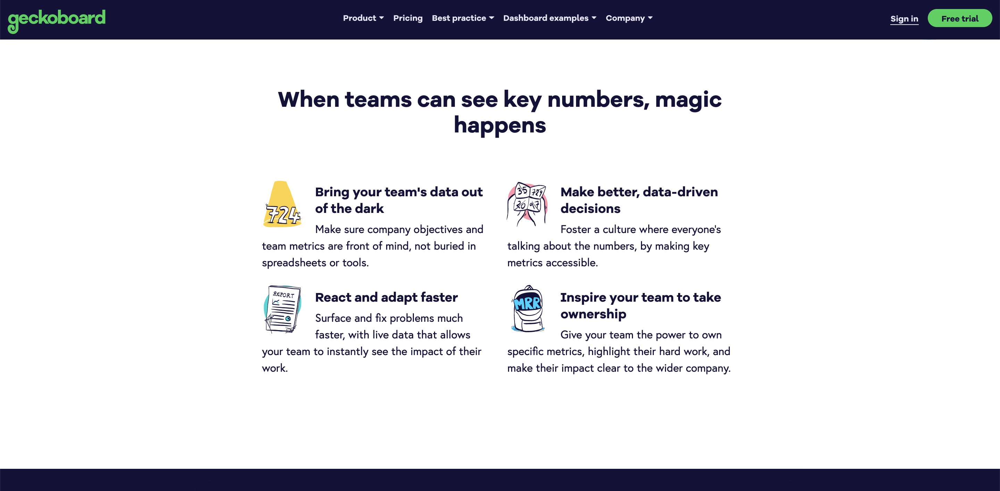
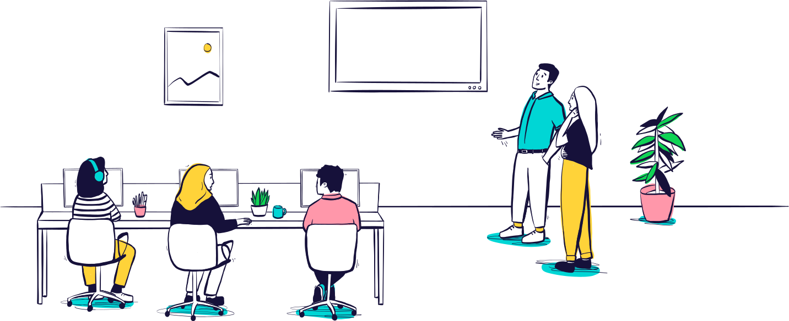
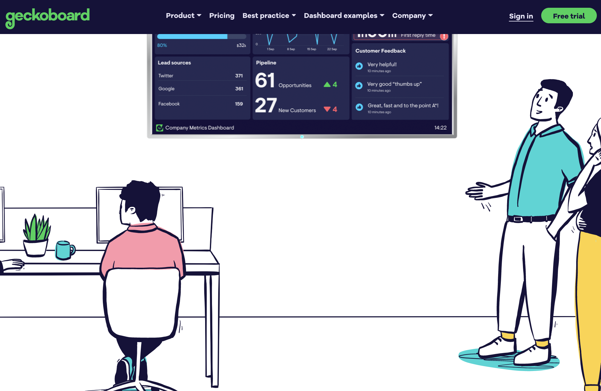

I was commissioned by Geckoboard, (a tech-startup-based-in-Shoreditch-and-an-office-full-of-top-people) for a set of four spot illustrations to illustrate their product's key benefits. I also created a hero illustration for their home page, to highlight their product. I drew all of these illustrations in a style to reflect their brand: friendly, hand-drawn, colourful, and human. 

|   |  |
| ------------- | ------------- |
|   |   |

Here are the spot illustrations in place on the website (which you can find [here](https://www.geckoboard.com/)):

The hero illustration I created for the startup is now used across their website and product with various arrangements of the assets.

For example, here is the illustration on the home page of their website (find it live [here]](geckoboard-homebullets-insitu.png)): 

<!-->

I created an animated illustration for the lovely people at Geckoboard to announce their launch and rebrand - keeping the style in line with the collection of illustrations I have previously drawn for them. They are a tech startup based in Shoreditch. The animated illustration went out on the company social media channels in a variety of sizes and arrangements, and a static version too. 

Check out the launch blog [here](https://www.geckoboard.com/blog/all-eyes-on-data-paul-introduces-the-new-geckoboard/) and the main website, which I also illustrated [here](https://www.geckoboard.com/).

<-->
