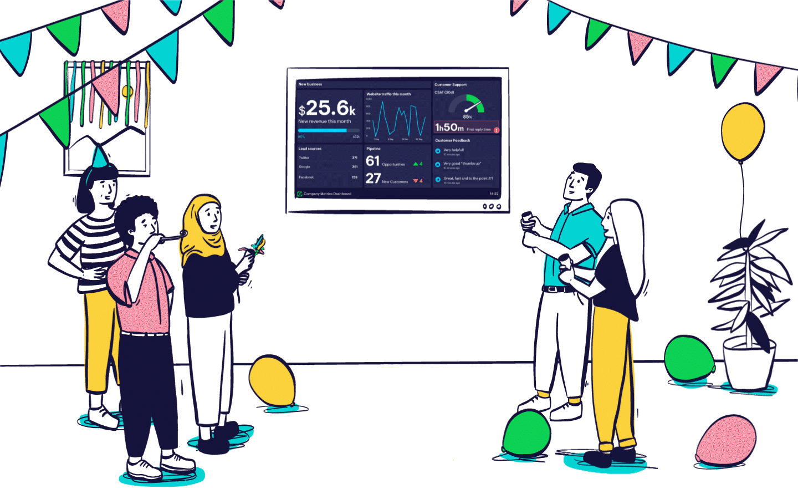
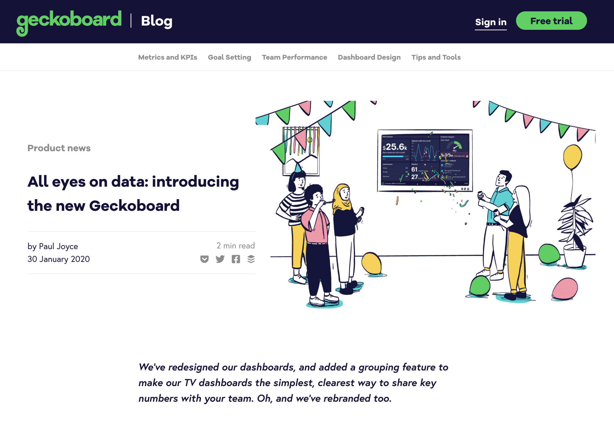
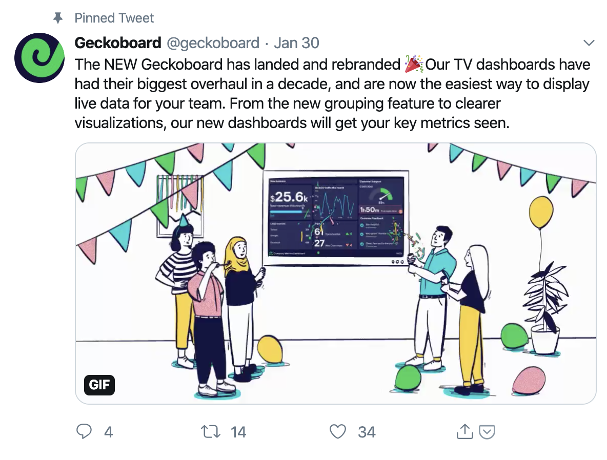
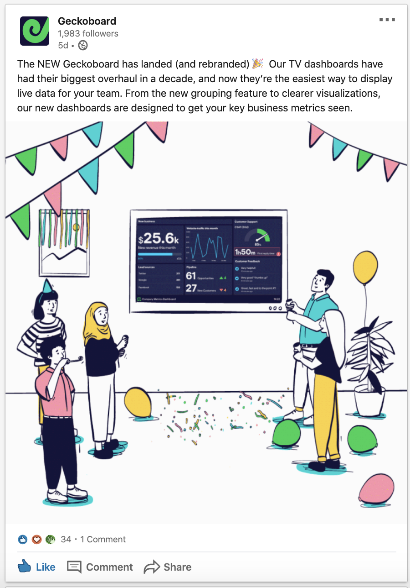
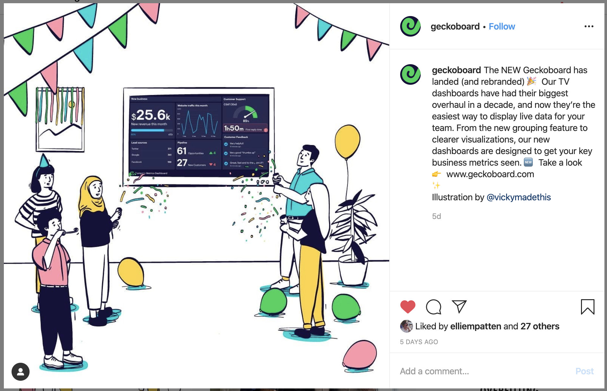

I created an animated illustration for the lovely people at Geckoboard to announce their launch and rebrand - keeping the style in line with the collection of illustrations I have previously drawn for them. They are a tech startup based in Shoreditch. The animated illustration went out on the company social media channels in a variety of sizes and arrangements, and a static version too.

Check out the launch blog [here](https://www.geckoboard.com/blog/all-eyes-on-data-paul-introduces-the-new-geckoboard/) and the main website, which I also illustrated [here](https://www.geckoboard.com/).

<!--

!-->

<blockquote class="twitter-tweet" data-width="520">
    
The NEW Geckoboard has landed and rebranded 🎉Our TV dashboards have had their biggest overhaul in a decade, and are now the easiest way to display live data for your team. From the new grouping feature to clearer visualizations, our new dashboards will get your key metrics seen. <a href="https://t.co/Nc1Uiy1mDF">pic.twitter.com/Nc1Uiy1mDF</a>

    &mdash; Geckoboard (@geckoboard) <a href="https://twitter.com/geckoboard/status/1222863163923816450?ref_src=twsrc%5Etfw">January 30, 2020</a>
</blockquote>

<blockquote class="instagram-media" data-instgrm-captioned data-instgrm-permalink="https://www.instagram.com/p/B78oBgyAkmc/?utm_source=ig_embed&amp;utm_campaign=loading" data-instgrm-version="12">
    <!-- Fallback text is JS fails to load; also helps SEO. -->
    

        <a href="https://www.instagram.com/p/B78oBgyAkmc" target="_blank">View this post on Instagram</a>
        

            <a href="https://www.instagram.com/p/B78oBgyAkmc" target="_blank">The NEW Geckoboard has landed (and rebranded) 🎉 Our TV dashboards have had their biggest overhaul in a decade, and now they’re the easiest way to display live data for your team. From the new grouping feature to clearer visualizations, our new dashboards are designed to get your key business metrics seen. 🆕 Take a look 👉 www.geckoboard.com ✨ Illustration by @vickymadethis</a>
        

        
A post shared by <a href="https://www.instagram.com/geckoboard" target="_blank"> Geckoboard</a> (@geckoboard) on <time>Jan 30, 2020 at 6:32am PST</time>

    

</blockquote>

    <iframe src="https://www.linkedin.com/embed/feed/update/urn:li:share:6628628475479642112"   frameborder="0" allowfullscreen="" title="Embedded post"></iframe>

